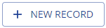
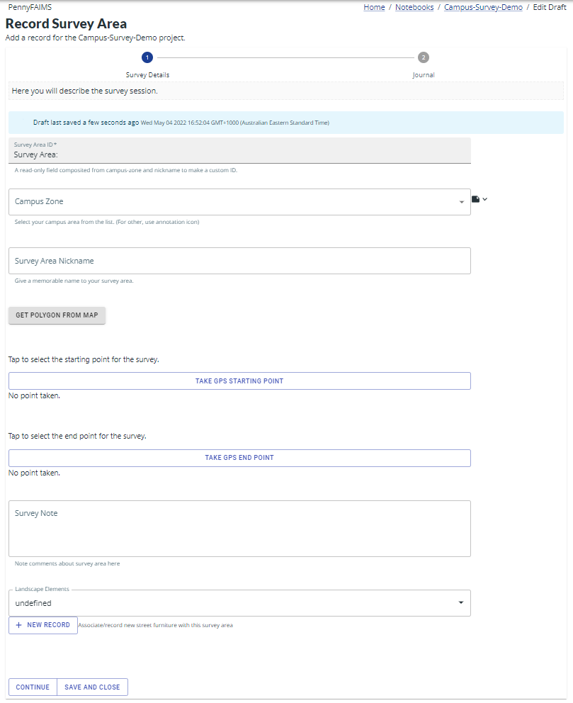
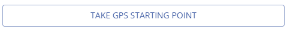
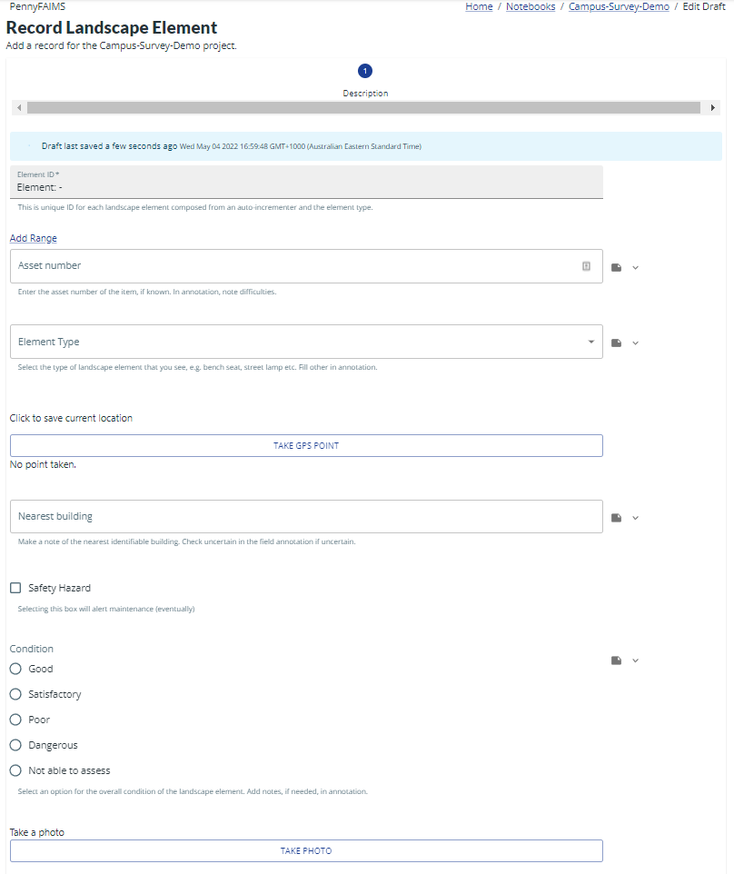
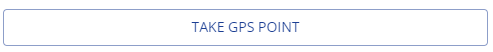
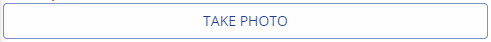
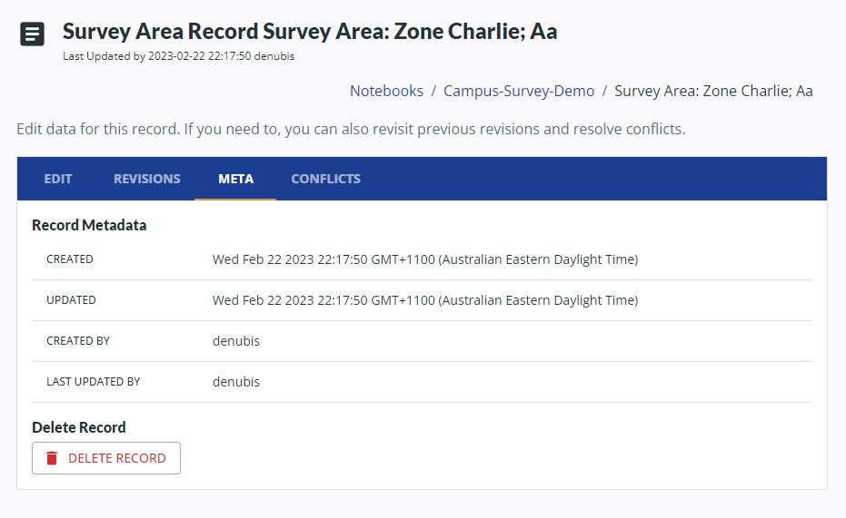

(demo-notebooks/demo-notebooks-campus-survey)=
# Demonstration Notebooks: Campus Survey

The *Campus-Demo-Notebook* is a simple workflow designed for a team of recorders to observe landscape elements and street furniture in a typical campus setting.

## Access

To access the survey go to <https://demo.3.faims.edu.au/> on your browser.

## Task 1: Setting ID ranges

The first task is setting parameters for the ID auto incrementors. This will allow each team to set starting and final ID numbers so that a unique sequence can be built across all the data collected. (This is a configurable setting and can be adjusted for each notebook.) To set the ID range:

1.  Choose settings
2.  Enter the range for your username, eg 0-49, 50-99:

| *Username*           | *Zone*  | *ID from* | *ID to* |
|----------------------|---------|-----------|---------|
| MQMarcusAgrippa      | Alpha   | 1         | 49      |
| MQActus              | Beta    | 50        | 99      |
| MQTralles            | Charlie | 100       | 149     |
| MQIsidoreOfMiletus   | Delta   | 150       | 199     |
| MQApolloudiusOfDamas | Other   | 200       | 249     |

3.  Click ‘update Range’.

### Task 2: Setting Survey Area

Each group will cover a ‘predetermined’ Survey area (Zone A, B etc) and enter some metadata before heading out into the field. To create a Survey Area record:

1.  Click on {height=3ex} in the top right corner of the Notebook homepage
2.  Select ‘Survey Area’ and you can begin to enter info (fictional or based on your observations) about the survey area:

    

3.  Select the Zone you have been allocated.
4.  Add a nickname (eg Eating Hall) to remember the area.
5.  Use the map view to draw a bounding polygon for the Survey Area.
6.  Tap {height=3ex} to capture the point at which you commenced the survey.
7.  Make a Note if needed.
8.  You must click {height=3ex} for the record to move from Drafts and be synchronized with other devices.

### Task 3: Data collection

Participants will head outside (if possible) and collect sample data.

You can create new Landscape Element records in two ways, either:

-   From the Survey Area view, by tapping {height=3ex} below ‘Landscape Elements’
-   From the Notebook homepage by tapping {height=3ex} in the top right corner of the screen and selecting ‘Survey Area’. (Note: Landscape elements added from the Home view will not be linked to a Survey Area. To associate an existing Landscape element with a Survey Area, select the landscape element from the dropdown list on the Survey Area view.)

You will see:

Once you have identified a target for survey (a bench seat, lamp post or sign):

1.  Enter an Asset ID (fictional or based on your observations)
2.  Select an Element Type from the dropdown.
3.  Tap {height=3ex} to capture a GPS point.
4.  Enter the name or number of the Nearest building
5.  Select a Condition from the radio list
6.  If the condition is so poor that it is dangerous (tap the Dangerous checkbox)
7.  Tap {height=3ex} to take a photograph and the Camera will be called.
8.  Make a Note if needed.

## Data editing and review

Back in the Lab, go to <https://demo.3.faims.edu.au/> and navigate to the *Campus-Survey-Demo*. Here you can search for all records that you have synchronized.

### Meta
To review record metadata tap on the META tab:

### Delete a Record

To delete a record, select DELETE RECORD from the META tab.

Note: no records are deleted, simply hidden from view.  
