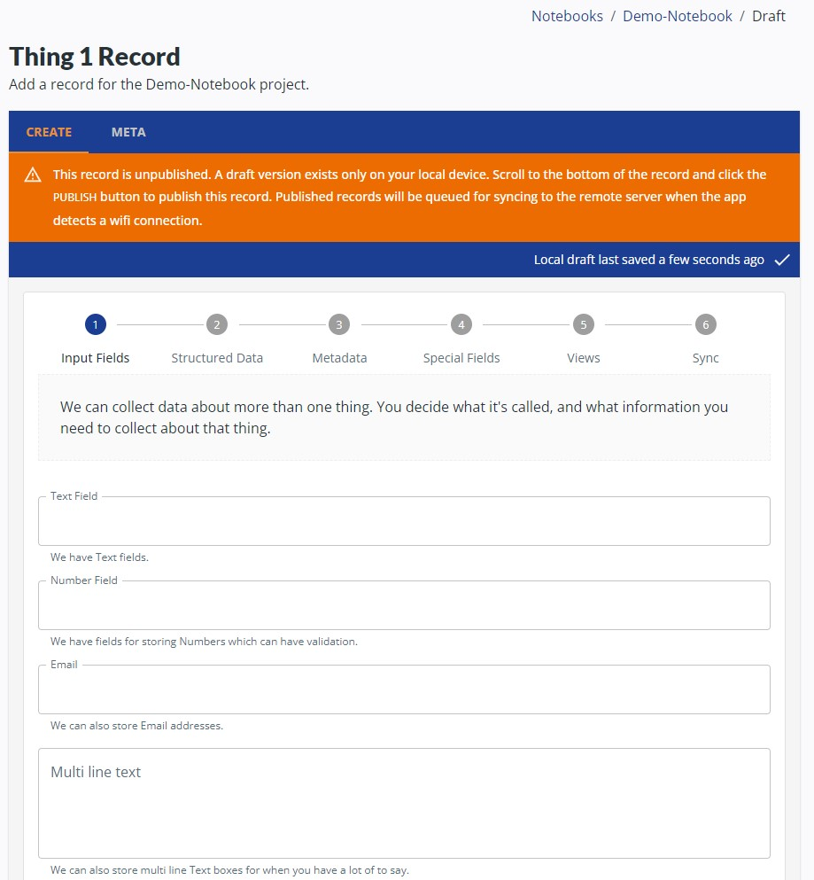

(demo-notebooks/demo-notebooks-demo)=
# Demonstration Notebooks: Demo Notebook

The *Demo Notebook* is a simple Notebook designed to showcase all the essential features of Fieldmark.

## Access the Demo Notebook

To access the survey go to <https://demo.3.faims.edu.au/> on your browser.

## Task 1: Create a Record
To add a new record for Thing 1, click [addThing 1]{.fieldmark-button} in the top right of the screen and follow the prompts to enter data:

## Data editing and review

### Meta
To review record metadata tap on the [META]{.blue-tab} tab on a published record.:

:::{image} demo-notebooks-campus-images/meta-demo.3.faims.edu.au_notebooks_default%7C%7Ccampus_survey_demo.png
:width: 70%
:align: center
:::

### Delete a Record

To delete a record, select [deleteDELETE RECORD]{.red-button} from the [META]{.blue-tab} tab.

:::{note}
No records are deleted, simply hidden from view. It is possible to undelete records with the command line.
:::

<link href="https://fonts.googleapis.com/icon?family=Material+Icons"
      rel="stylesheet">